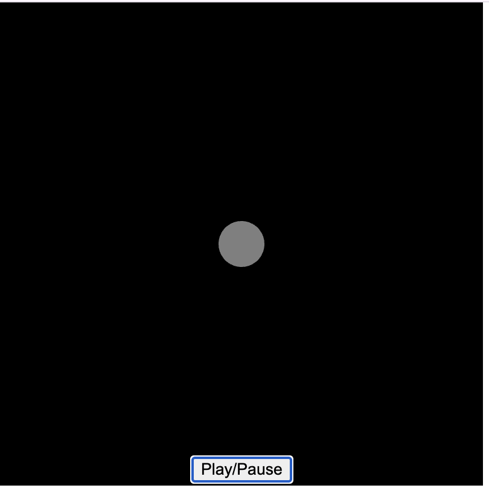
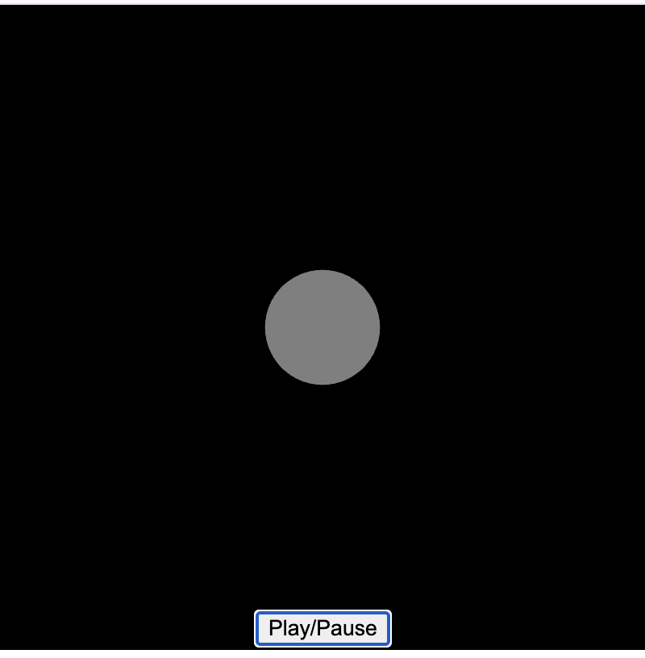

# xwan0195_FinalIndividual
My Final individual assignment for IDEA9103. A p5.js–powered animation that responds to audio and user input.  

## Interaction Guide
1. **Play / Pause**  
   - Click the **Play** button at the bottom center to start the background beat & animation.  
   - Click **Pause** to stop both audio and motion.
2. **Volume Control**  
   - Move your **mouse vertically** (up/down) to increase or decrease the volume in real time.
3. **Stereo Panning**  
   - Move your **mouse horizontally** (left/right) to adjust left–right audio balance.
4. **Automatic Animation**  
   - Once audio plays, shapes in the canvas will scale and pulse according to the beat within **0.5–1.5×** of their original size.

## Personal Animation Approach
### 1.Selected drive mode
- **Audio**:Use the level or frequency content of an audio track to animate your work.

### 2. Which properties of the image will be animated and how
- **Which Properties?**  
  - **Scale:** All shapes grow and shrink around their center point in sync with the beat.  
  - **Stroke Weight:** Outline thickness thickens on strong beats.

- **Audio Amplitude:** I use `p5.Amplitude` to read real-time audio levels and map them to shape scaling factors.
- **Mouse Interaction:** `mouseX` and `mouseY` values drive stereo panning and volume mapping.

- **How It Differs from Teammates:**  
  - **My Component:** Purely audio-driven pulsing of shape size and stroke.

### 3. Inspirations
- **Static Mockup:**  
  
  

- **Impact on My Code:**  
  - Adopted the “pulse on beat” idea from the p5.js Sound Examples.

## Technical Notes & References
1. **Major Code Changes**
   - Wrapped interactive controls in a custom UI panel created via `createButton()` and CSS.

2. **External Tools & Techniques**  
   - All use tools and technique from the course

3. **Copied / Adapted Techniques**
   - All use tools and technique from the course